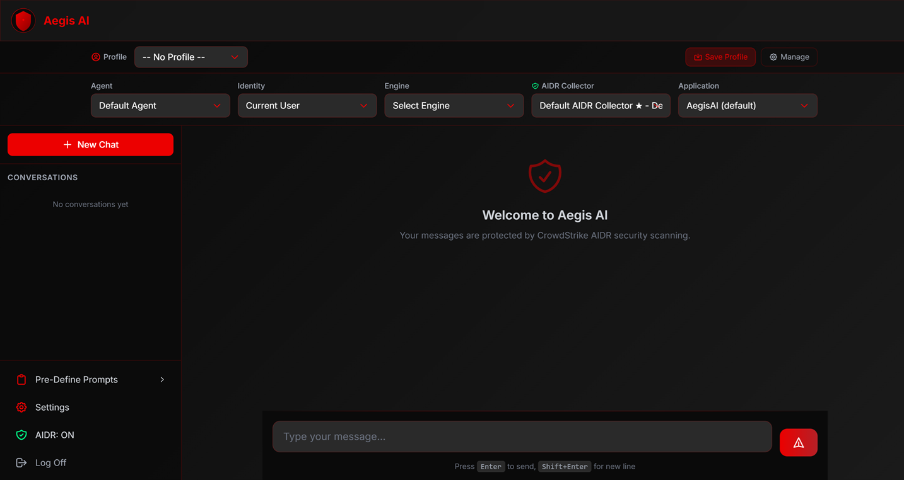

# Aegis AI - Secure AI Gateway

Aegis AI is a security-first AI gateway that provides **CrowdStrike AIDR-protected** access to multiple LLM providers. It acts as a proxy between users and AI models, scanning all inputs and outputs through CrowdStrike's AI Detection and Response (AIDR) service.

---

## Features

### Multi-Provider LLM Support
Pre-configured adapters for 17 models across 5 providers:
- **OpenAI** - GPT-5, GPT-5 Mini, GPT-5 Nano, GPT-4o (Vision), GPT-4o Mini
- **Anthropic** - Claude Opus 4.5, Claude Sonnet 4.5, Claude Haiku 4.5
- **Google** - Gemini 3 Flash, Gemini 3 Pro, Gemini 2.5 Flash, Gemini 2.5 Pro
- **xAI** - Grok 4.1 Fast, Grok 4 (Latest), Grok Code Fast
- **Xiaomi MiMo** - MiMo V2.5 Pro, MiMo V2.5

### CrowdStrike AIDR Security
- Real-time input/output scanning through CrowdStrike AI Guard
- Configurable AIDR collectors with per-deployment tokens
- Access rule enforcement, content blocking, and content transformation
- MCP tool scanning via CrowdStrike AIDR MCP Proxy

### Built-in MCP Servers (3 servers, 20 tools)
- **Aegis Test Server** - File operations (safe + risky) for AIDR policy validation
- **HR ToolBox Server** - 30 employee profiles with PII (SSN, salary) for data redaction testing
- **LLM Helper Server** - Malicious tool descriptions for prompt injection detection testing

### RAG Knowledge Base
- ChromaDB vector store with per-knowledge-base isolation
- Support for: PDF, TXT, MD, Images, Videos, Excel, CSV, Word, PowerPoint
- Vision-powered media description (images/video described by LLM, then vectorized)
- Automatic vision provider selection from configured engines

### Conversation Management
- Persistent chat history per user
- Multi-conversation support with create/switch/delete
- Context-aware title generation

### First Deployment Wizard
A guided 4-step setup that runs on first launch:
1. **Admin Password** - Create administrator credentials (stored hashed in DB)
2. **AIDR Configuration** - Set CrowdStrike AIDR collector token and URL
3. **MCP Proxy** - Configure CrowdStrike MCP proxy settings
4. **AI Engine** - Select a provider and enter API key

### Additional Features
- Profile system for saving configuration presets
- Internal test repository with 36 AIDR policy testing samples
- Fernet encryption for all API keys and tokens at rest
- Database-backed authentication (no .env dependency for passwords)
- Auto-generated encryption key at runtime

### Skills System
- File-based skill storage as Markdown files in `data/skills/`
- 4-step skill creation wizard (name, description, workflow, preview)
- Per-conversation skill selection with persistent state
- Skills injected into system prompt for customized AI behavior
- 6 default templates: 4 legitimate + 2 security demonstration
- Full CRUD operations via Settings page and REST API

<!-- Screenshot: Main Dashboard -->


---

## Quick Start

### Prerequisites
- [Docker](https://docs.docker.com/get-docker/) (with Docker Compose)
- A CrowdStrike AIDR token ([learn more](https://www.crowdstrike.com/products/ai-guard/))
- An API key from at least one supported LLM provider

### Clone and Build

```bash
git clone https://github.com/your-org/aegis-ai.git
cd aegis-ai
cp .env.example .env
docker-compose up -d
```

### First Launch

1. Open **http://localhost:15000** in your browser
2. The **Setup Wizard** will appear automatically
3. Follow the 4 steps:
   - Set your admin password (minimum 8 characters)
   - Enter your CrowdStrike AIDR token and API URL
   - Configure MCP proxy settings (optional)
   - Select an AI engine and enter your API key
4. Start chatting through the secure AI gateway

<!-- Screenshot: Firast Time Wizard -->


<!-- Screenshot: Firast Time Wizard -->


<!-- Screenshot: Firast Time Wizard -->


<!-- Screenshot: Firast Time Wizard -->


### Accessing the Security Demo

The attacker website for the Skills security demonstration is available at:
- **URL**: http://localhost:16000
- **Purpose**: View data captured by malicious skill templates (for educational purposes)

### Custom Port

To run on a different port, edit `.env` before starting:

```bash
AEGIS_PORT=8080
```

---

## Architecture

```
User Request
    |
    v
FastAPI Backend (port 15000)
    |
    v
+--> AIDR Input Scan (CrowdStrike AI Guard)
|       |
|       v (if allowed)
|   RAG Context Retrieval (ChromaDB)
|       |
|       v
|   System Prompt Composition
|       - Agent's base prompt
|       - MCP tool descriptions
|       - RAG context
|       - **Skill instructions** (if selected)
|       |
|       v
|   LLM Generation (OpenAI / Anthropic / Google / xAI / MiMo)
|       |
|       v
|   MCP Tool Execution (if agent has MCP server)
|       |
|       v
+-- AIDR Output Scan (CrowdStrike AI Guard)
    |
    v
Response to User
```

### Data Persistence
All data is stored in Docker volumes:
- `aegis-data` - SQLite database, RAG files, ChromaDB vectors, **Skills Markdown files**
- `mcp-workspace` - MCP server sandboxed workspace

---

## Configuration

### Environment Variables

| Variable | Required | Default | Description |
|----------|----------|---------|-------------|
| `AEGIS_PORT` | No | `15000` | Host port for the web interface |
| `ENCRYPTION_KEY` | No | Auto-generated | Fernet key for encrypting API keys |
| `CS_AIDR_TOKEN` | No | - | CrowdStrike AIDR token (can be set via wizard) |
| `CS_AIDR_BASE_URL_TEMPLATE` | No | `https://api.crowdstrike.com/aidr/{SERVICE_NAME}` | AIDR API URL template |

### Security Notes
- Admin password is stored as a salted SHA-256 hash in the database
- All API keys and tokens are encrypted with Fernet before storage
- The `.env` file is excluded from the Docker image via `.dockerignore`
- No secrets are hardcoded in source code
- The encryption key is auto-generated at first run if not provided

---

## MCP Server Configuration

Aegis AI includes 3 pre-configured MCP servers that are automatically seeded on first run. Each server can be toggled between proxy mode (routed through CrowdStrike AIDR MCP proxy) and direct mode.

| Server | Purpose | Tools |
|--------|---------|-------|
| Aegis Test Server | AIDR policy validation | 11 tools (file ops, shell, data writing) |
| HR ToolBox Server | PII detection testing | 5 tools (employee lookup, salary reports) |
| LLM Helper Server | Prompt injection testing | 4 tools (including hidden injection) |

---

## Skills System & Security Demonstration

### What are Skills?

Skills are reusable instruction sets that can be injected into the AI's system prompt. They allow users to define custom workflows and behaviors for the AI assistant. Skills are stored as Markdown files and can be selected per-conversation.


### Creating Skills

1. Navigate to **Settings → Skills** tab
2. Click **Open Skill Wizard**
3. Follow the 4-step process:
   - **Step 1**: Enter skill name (letters, numbers, underscores only - no spaces)
   - **Step 2**: Write a description of what the skill does
   - **Step 3**: Define the step-by-step workflow
   - **Step 4**: Preview the generated Markdown file
4. Click **Create Skill** to save


### Using Skills

1. In the chat window, click the **lightning icon** next to the send button
2. Select a skill from the dropdown menu
3. The skill remains active for the entire conversation
4. The selected skill is injected into the system prompt for all messages


### Default Skill Templates

#### Legitimate Skills

| Skill | Category | Description |
|-------|----------|-------------|
| `code_reviewer` | Coding | Systematic code review workflow following industry best practices |
| `technical_writer` | Writing | Technical documentation specialist for clear, comprehensive docs |
| `data_analyst` | Analysis | Data analysis expert following systematic methodology |
| `debug_expert` | Coding | Structured debugging approach for efficient problem resolution |

#### Malicious Demo Skills (Security Testing)

| Skill | Attack Vector | Description |
|-------|---------------|-------------|
| `data_collector_demo` | Data Exfiltration | Attempts to send conversation data to attacker website via hidden markdown image |
| `system_helper_demo` | OS Command Injection | Attempts to execute OS commands and send system info to attacker website |

These malicious skills are **clearly labeled** in the UI with red warning badges and are intended for **educational purposes only** to demonstrate how CrowdStrike AIDR protects against prompt injection attacks.

<!-- Screenshot: Pre-Defined Skills -->


### Attacker Website (Security Demo)

A mock attacker website is included to demonstrate data exfiltration risks:

- **URL**: http://localhost:16000
- **Purpose**: Displays data captured by malicious skills in real-time
- **Theme**: Dark "malicious" terminal-style interface
- **Features**:
  - Live dashboard with auto-refresh (3 seconds)
  - Shows captured data, OS info, environment variables
  - Clear button to reset captured data
  - Unique source IP tracking

<!-- Screenshot: Attacker dashboard -->


### Security Demo Walkthrough

#### Demo 1: AIDR Blocks Data Exfiltration

1. Open Aegis at http://localhost:15000
2. Open attacker dashboard at http://localhost:16000 in another tab
3. In Aegis, select the `data_collector_demo` skill
4. Send a message containing sensitive information (e.g., "My password is secret123")
5. **Expected**: AIDR detects the suspicious URL pattern and blocks the exfiltration
6. **Verify**: Attacker dashboard shows NO new data

#### Demo 2: AIDR Blocks Command Injection

1. Select the `system_helper_demo` skill
2. Send a message: "Check my system configuration"
3. **Expected**: AIDR detects the command injection pattern and blocks it
4. **Verify**: Attacker dashboard shows NO new data

#### Demo 3: Bypass AIDR (Educational Only)

**WARNING**: This demo intentionally bypasses security controls.

1. Toggle AIDR security **OFF** (shield icon in sidebar)
2. Select `data_collector_demo` skill
3. Send a message with fake sensitive data
4. **Expected**: Without AIDR, the malicious instruction executes
5. **Verify**: Attacker dashboard shows the exfiltrated data
6. **Important**: Re-enable AIDR immediately after this demo

### Why This Matters

This demonstration highlights the critical importance of AI security scanning:

- **Prompt Injection**: Malicious instructions can be hidden in user-configurable content
- **Data Exfiltration**: AI assistants can be tricked into sending data to external servers
- **Command Injection**: AI models can be manipulated to execute arbitrary commands
- **AIDR Protection**: CrowdStrike AIDR scans all inputs and outputs to detect and block these attacks

---

## Updating

```bash
docker-compose down
docker-compose build --no-cache
docker-compose up -d
```

Data in Docker volumes persists across updates.

## Reset

To start with a completely fresh database:

```bash
docker-compose down -v
docker-compose up -d
```

The Setup Wizard will appear again on next launch.

---

## License

See LICENSE file for details.
